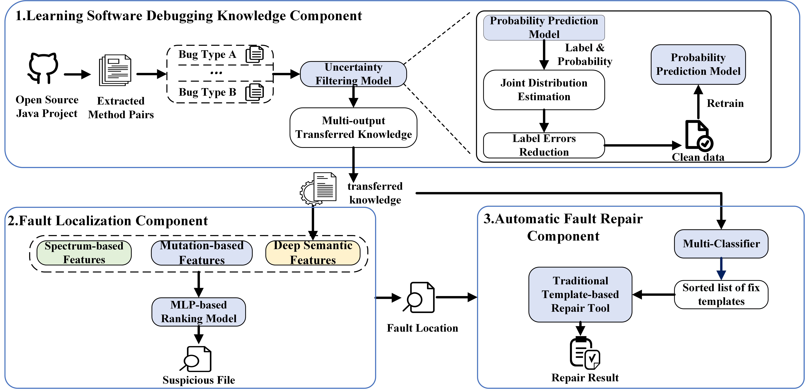

# D-Helper

I. Requirements
--------------------
 - [Java 1.7](https://www.oracle.com/technetwork/java/javase/downloads/java-archive-downloads-javase7-521261.html)
 - [Python 3.6](https://www.python.org/downloads/)
 - [Defects4J 1.2.0](https://github.com/rjust/defects4j/releases/tag/v1.2.0)
 - [SVN >= 1.8](https://subversion.apache.org/packages.html)
 - [Git >= 1.9](https://git-scm.com/)
 - [Perl >= 5.0.10](https://www.perl.org/get.html)
 - [PyTorch-1.5.1](https://pytorch.org/)
- [CleanLab-1.0.1]()

II. Overview of D-Helper
--------------------



III.Introduction
---------------------------
D-Helper is a transfer learning-based technology for software automated debugging, which encompasses fault localization and automatic fault repair.

For fault localization, D-Helper leverages transfer learning to extract deep semantic features from a vast collection of open-source Java projects. These features are then combined with spectrum-based and mutation-based features as inputs to a ranking model, enabling precise fault localization at the statement level.

For automatic fault repair, D-Helper employs template-based repair methods. Furthermore, it utilizes transfer learning techniques to address the challenge of template selection, which traditional template-based repair approaches struggle with.

IV. Prepare Dataset For Training
---------------------------

1. Click the following url link and download the necessary dataset used in this research.

    [data_for_transfer.zip](https://mega.nz/file/u0wQzRga#Q2BHCuRD2aW_61vshVbcxj-ObYh2cyGhqOAmAXNn-T0)

2. Unzip it and put the extracted datasets in the corresponding path: 
    * Put `dataset_fl.pkl` into `./fault_localization/`
    * Put `dataset_pr.pkl` into `./program_repair/`
    * Put `src_code.pkl` into `./fault_localization/binary_classification/d4j_data/` 


V. Prepare Dataset For Testing
---------------------------
 1. Download and install [Defects4J 1.2.0](https://github.com/rjust/defects4j/releases/tag/v1.2.0), after which the required settings described in its readme file must be completed.
 
 2. Check out and compile each bug. There are 395 bugs in total, but only 71 bugs are necessary to be checked out for our repair experiments, which are listed in `./program_repair/automatic_fix/versions.txt`. All checked out bugs should be put into the directory `./program_repair/automatic_fix/projects/` and follow the same naming standard with `versions.txt` (i.g., Chart_1).
  
 3. Export environment variable `D4J_HOME` as the root dir of Defects4j.
 
 4. Defects4J contains 395 bugs from the following open-source projects:

| Identifier | Project name         | Number of bugs |
|------------|----------------------|----------------|
| Chart      | JFreeChart           |  26            |
| Closure    | Closure compiler     | 133            |
| Lang       | Apache commons-lang  |  65            |
| Math       | Apache commons-math  | 106            |
| Mockito    | Mockito              |  38            |
| Time       | Joda-Time            |  27            |

VI. Reproduce All Experiments from Scratch 
--------------------------
1. For fault localization:
    * Since three features groups are needed to run MLP-based ranking model for fault localization, the spectrum-based and mutation-based features are already extracted by using [GZoltar 1.7.2](https://github.com/GZoltar/gzoltar/releases/tag/v1.7.2) and [PIT 1.1.5](https://pitest.org/downloads/) tools respectively. While the semantic features are generated from 11 BiLSTM-based binary classifiers, you should train them on dataset_fl first to obtain the transferrd knowledge which are then used to generate 11-dimension semantic features for each suspicious statement in Defects4J bug. The steps to obtain the 11-dim semantic features are as follows:
        * Enter `./fault_localization/binary_classification/script/` and run `python data_preprocess.py <fix_template>`, then training data from dataset_fl are generated to train the corresponding  binary classifier of each fix template (bug type). The `<fix_template>` in the command is expected to replaced with one of the following 11 fix templates:
            * InsertMissedStmt
            * InsertNullPointerChecker
            * MoveStmt
            * MutateConditionalExpr
            * MutateDataType
            * MutateLiteralExpr
            * MutateMethodInvExpr
            * MutateOperators
            * MutateReturnStmt
            * MutateVariable
            * RemoveBuggyStmt
        * Enter `./fault_localization/binary_classification/code/` and run `python train.py <fix_tempalte>` to train the corresponding binary classifier. The optimal parameters are save in relative dir `./model_save/` of current path.
        * Enter `./fault_localization/binary_classification/script/` and run `python data_preprocess_for_d4j.py <fix_remplate>` to preprocess each suspicious statement in Defects4J dataset. `<fix_template>` should also be replaced with 11 fix templates.
        * Enter `./fault_localization/binary_classification/code/` and run `python predict_for_d4j.py` to obtain the final 11-dim semantic features which lotates in `../d4j_data/semantic.pkl`.
    * Having obtained the semantic features, we then generate samples for our fault localization task. You can enter `./fault_localization/ranking_task/` and run `python gen_data.py` to generate samples from Defects4J with 3 different feature groups.
    * You can enter the path `./fault_localization/ranking_task/run_model/`, and run `python run_group.py` command. This command includes the training and testing phases. If gpus are used, the test reuslts can usually be obtained within 10 miniutes. If cpus are used, please replace `True` at line 46 with `False` in `train.py` file first.
2. For automated program repair:
    * We should first train a BiLSTM-based multi-classifier to learn the transferred knowledge for the subsequent fix template selection task in program repair. Thus, two steps are needed, which are as follows:
        * Enter `./program_repair/pattern_selection/` and run `python pipeline.py` to generate samples from dataset_pr to train the multi-classifier.
        * Enter the same dir, and run `python train_github.py` to train the multi-classifier. The optimal parameters are saved in the relative dir `./model_save/`.
        * Enter the same dir, and run `python train_d4j.py` to fine-tune the parameters of the model. The optimal parameters are saved in the relative dir `./model_save_d4j/`.
    * The trained multi-classifier can be embeded into the state-of-the-art template-based program repair technique [TBar](https://github.com/TruX-DTF/TBar) to optimize the fix template selection task.
        * Copy `./program_repair/pattern_selection/model_save_d4j/` and `./program_repair/pattern_selection/data/train/embedding/w2v_32` to `./program_repair/automatic_fix/dnn_model/`, and then run `python parse_version.py`.
        * Use the new generated suspicious files in Section VI(1) to program repair task. Specifically, to enter `./program_repair/automatic_fix/script/` and run `python get_sus_file.py`.
        * You can enter the path `./program_repair/automatic_fix/shell_71_versions/`, and run `python generate_shell.py` to generate the shell file containing 71 serial commands for 71 bugs in Defects4J. Then, you can run `chomd +x run_repair.sh`to give the executable authority to the newly generated shell file. Finally, you can run `./run_repair.sh` to obtain the repair result. All repair logs are shown in `./program_repair/dnn_model/dnn_tbar_log/`, and all generated plausible patches are shown in `./program_repair/automatic_fix/OUTPUT/`. 


```
